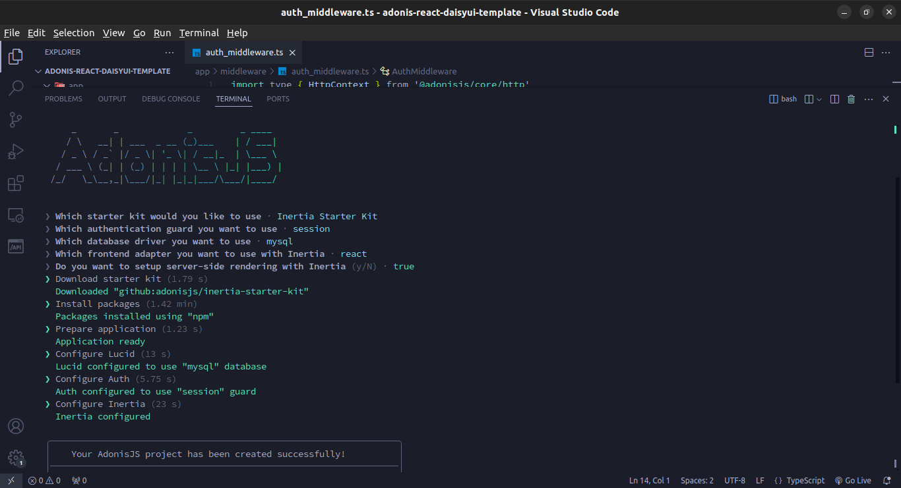

# 🌟 Adonis JS + Inertia React + Daisy UI TailwindCSS 🌟

This project is a modern web application built using **Adonis JS** as the backend framework, **Inertia.js** for a full-stack SPA experience, and **React** as the frontend library. **TailwindCSS** is used for styling, enhanced by the **Daisy UI** component library for easy-to-use, customizable UI components.

## 📋 Table of Contents

- [🚀 Getting Started](#-getting-started)
- [⚡ Quick Setup](#-quick-setup)
- [🔧 Manual Setup](#-manual-setup)
- [🎨 Installing TailwindCSS](#-installing-tailwindcss)
- [🌼 Installing Daisy UI](#-installing-daisy-ui)
- [🛠 Customization](#-customization)
- [🔗 Useful Links](#-useful-links)

## 🚀 Getting Started

To get started with this project, you will need Node.js and npm installed on your machine. You have two options to set up this project: **Quick Setup** by cloning the repository or **Manual Setup** by following step-by-step instructions.

## ⚡ Quick Setup

If you want to get started quickly, you can clone the entire project, which includes Adonis JS, Inertia React, TailwindCSS, and Daisy UI already configured:

1. **Clone the Repository**:

   ```bash
   git clone https://github.com/hidayahapriliansyah/adonis-react-daisyui-template
   cd adonis-react-daisyui-template
   ```

2. **Install Project Dependencies**:

   ```bash
   npm install
   ```

3. **Run Development Server**:

   ```bash
   npm run dev
   ```

Your development environment should now be up and running! 🎉

## 🔧 Manual Setup

Follow these steps if you prefer to set up everything from scratch:

### 1. **Adonis JS Setup**

Start by setting up Adonis JS using the official installation guide:

1. Create a new Adonis project:

   ```bash
   npm init adonisjs@latest adonis-react-daisyui
   cd adonis-react-daisyui
   ```

2. Follow the typical Adonis setup as shown below:

   

   For detailed instructions, refer to the [Adonis JS Documentation](https://docs.adonisjs.com/guides/getting-started/installation).

## 🎨 Installing TailwindCSS

To style the application using TailwindCSS, follow these steps:

1. **Install TailwindCSS**: Follow the installation guide for TailwindCSS in Adonis JS, available [here](https://tailwindcss.com/docs/guides/adonisjs).

2. **Configure TailwindCSS**: Replace the default `app.css` file in the `inertia/css` folder with the following content:

   ```css
   @tailwind base;
   @tailwind components;
   @tailwind utilities;
   ```

3. **Run Development Server**: After making these changes, restart your development server to see the updates.

   ```bash
   npm run dev
   ```

## 🌼 Installing Daisy UI

Daisy UI is a TailwindCSS component library that provides a set of pre-styled components.

1. **Install Daisy UI**: Follow the installation instructions provided in the Daisy UI documentation [here](https://daisyui.com/docs/install/).

2. **Configure Daisy UI Theme**: You can customize the Daisy UI theme to suit your needs. Instructions for theme customization are available [here](https://daisyui.com/docs/themes/).

## 🛠 Customization

- **Daisy UI Theme**: Modify the default Daisy UI theme settings in the `tailwind.config.js` file to customize the look and feel of your application. 

- **Components**: Use Daisy UI components to quickly build responsive and interactive UI elements. Check out the component library [here](https://daisyui.com/components/button/).

## 🔗 Useful Links

- [📚 Adonis JS Documentation](https://docs.adonisjs.com/guides/getting-started/installation)
- [📘 TailwindCSS Adonis Integration](https://tailwindcss.com/docs/guides/adonisjs)
- [🌸 Daisy UI Documentation](https://daisyui.com/docs/install/)

## 🎉 Conclusion

With Adonis JS as the backend framework, Inertia.js for handling SPA functionality, and TailwindCSS with Daisy UI for styling, this setup provides a solid foundation for building modern, scalable, and maintainable web applications. Whether you prefer the quick setup method or a manual step-by-step installation, this guide has you covered. Happy coding! 😊